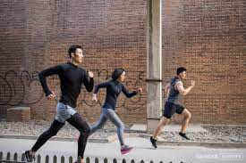
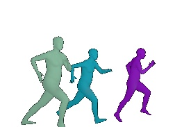
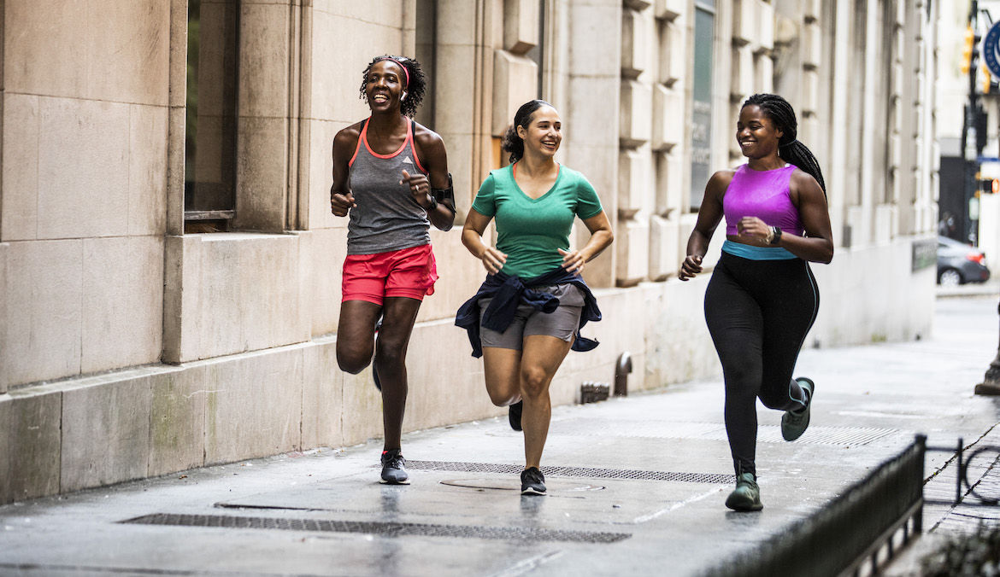
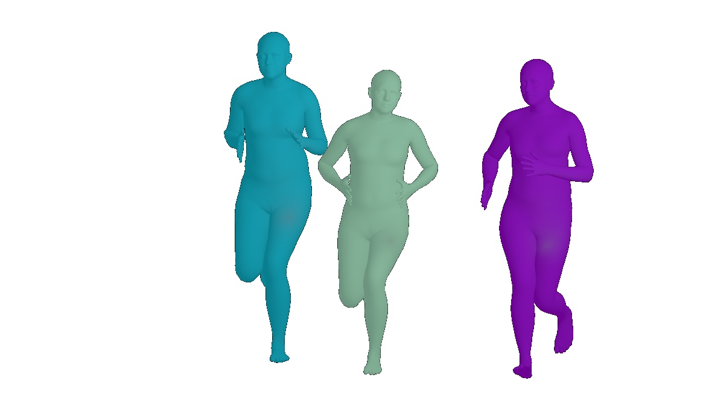
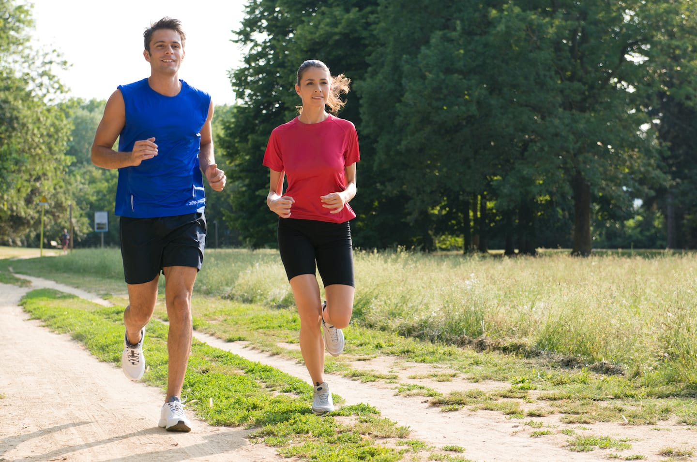
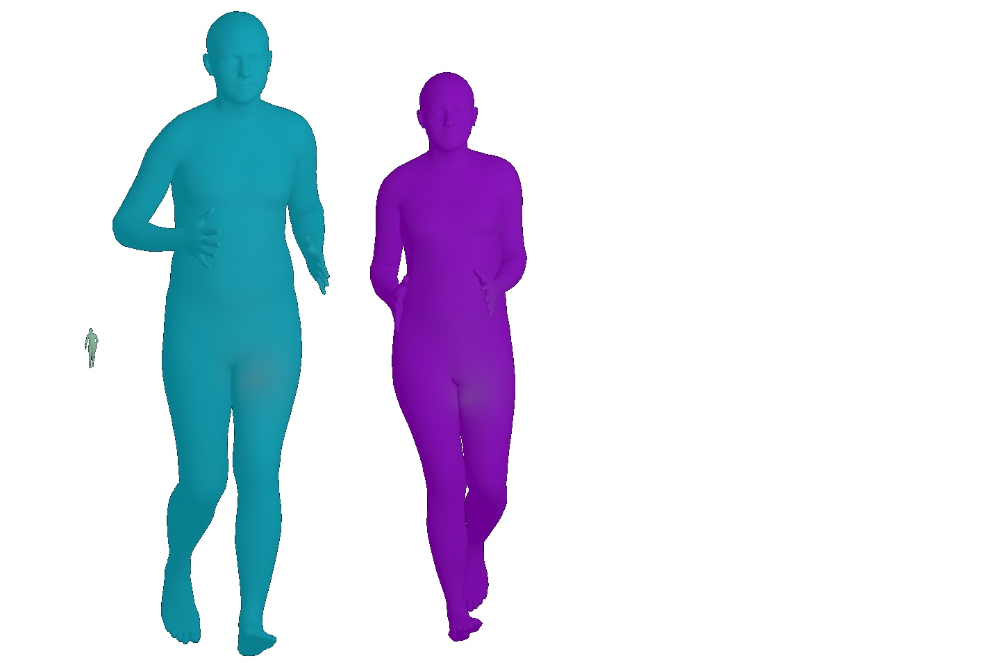

[](https://pytorch.org/)
[]([https://pytorch.org](https://arxiv.org/pdf/2210.13529.pdf)/)


# MultiPerson
Official code of **[Multi-Person 3D Pose and Shape Estimation via Inverse Kinematics and Refinement](https://arxiv.org/pdf/2210.13529.pdf)**

[Junuk Cha](https://sites.google.com/view/junuk-cha/%ED%99%88?authuser=0), Muhammad Saqlain, GeonU Kim, Mingyu Shin, [Seungryul Baek](https://sites.google.com/site/bsrvision00/)

|In the Wild Input|Output|
|:---:|:---:|
|||
|||
|||


# Installation
```
git clone https://github.com/JunukCha/MultiPerson.git
```

```
cd MultiPerson
```
Anaconda must be installed in your computer.

```
source install.sh
```

If it has been installed well so far, it has a folder tree structure as shown below and your virtual environment name is set to 'MultiPerson'. 
```
.MultiPerson
├── configs
├── demo_image
├── lib
├── .gitignore
├── README.md
├── demo.py
├── install.sh
├── requirements.txt
└── YOLOv4
```

# Data Preparation
For Yolo, download [yolov4.pth](https://drive.google.com/open?id=1wv_LiFeCRYwtpkqREPeI13-gPELBDwuJ) and place it as below.
```
.MultiPerson
└── YOLOv4
    └── weight
        └── yolov4.pth
```

1. Download data in [Google Drive](https://drive.google.com/drive/folders/1n-RAw6XWdDPPQT-vJfyCv9_A7KbYTWOw?usp=sharing) and place them as below.
2. Download "basicModel_neutral_lbs_10_207_0_v1.0.0.pkl" from [SMPL web page](https://smpl.is.tue.mpg.de/) and place it as below.

```
.MultiPerson
├── data
│   ├── base
│   │   ├── 32_to_122.npy
│   │   └── joint_info.pkl
│   ├── checkpoints
│   │   ├── inverse_kinematics.pth
│   │   ├── model_checkpoint.pt
│   │   ├── pose_estimator.pth
│   │   └── transformer.pth
│   └── smpl
│       ├── basicModel_neutral_lbs_10_207_0_v1.0.0.pkl
│       ├── h36m_mean_beta.npy
│       ├── J_regressor_extra.npy
│       ├── J_regressor_h36m.npy
│       └── smpl_mean_params.npz
```

In 'yolov4.pth', the key name 'neek' of the parameter should be changed to 'neck'.
```
python change_param_key.py
```

# Inference
```
python demo.py --img demo_image/demo1.jpg
```
